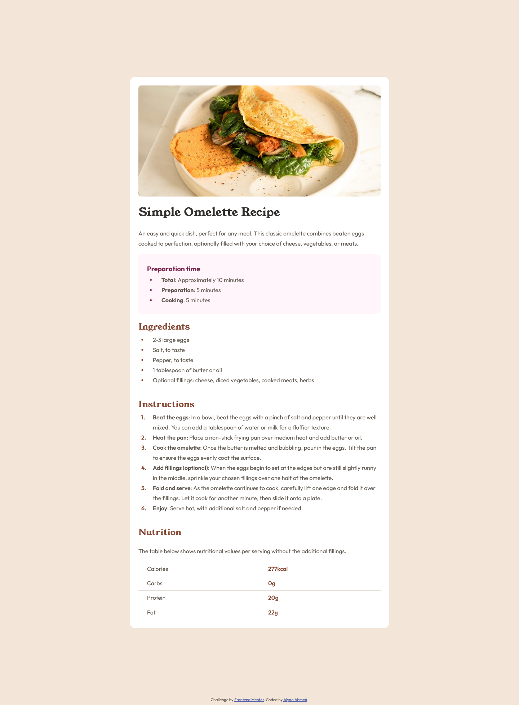
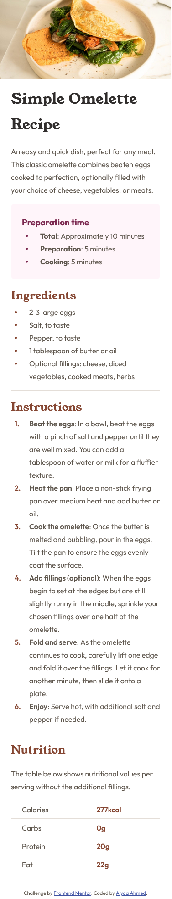

# Frontend Mentor - Recipe page solution

This is a solution to the [Recipe page challenge on Frontend Mentor](https://www.frontendmentor.io/challenges/recipe-page-KiTsR8QQKm). Frontend Mentor challenges help you improve your coding skills by building realistic projects.

## Table of contents

- [Frontend Mentor - Recipe page solution](#frontend-mentor---recipe-page-solution)
  - [Table of contents](#table-of-contents)
  - [Overview](#overview)
    - [Screenshot](#screenshot)
    - [Links](#links)
  - [My process](#my-process)
    - [Built with](#built-with)
  - [Author](#author)

## Overview

### Screenshot

<table>
 <tr>
    <th>Desktop</th>
    <th>| Mobile</th>
  </tr>
  <tr>
    <td></td>
    <td></td>
  </tr>
</table>

### Links

- Solution URL: [Frontend Mentor]()
- Live Site URL: [Netlify]()

## My process

### Built with

- Semantic HTML5 markup
- CSS custom properties
- Flexbox
- Mobile-first workflow
- Media Queries

## Author

- Frontend Mentor - [@AlyaaRushdy](https://www.frontendmentor.io/profile/AlyaaRushdy)
- Linkedin - [Alyaa Ahmed](https://www.linkedin.com/in/alyaa-ahmed/)
